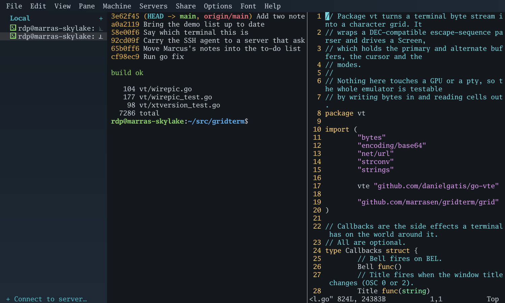
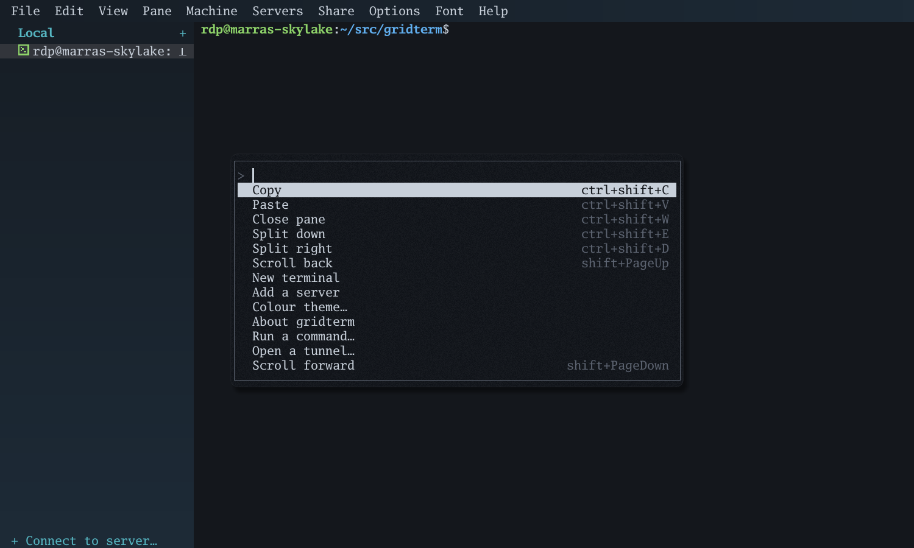
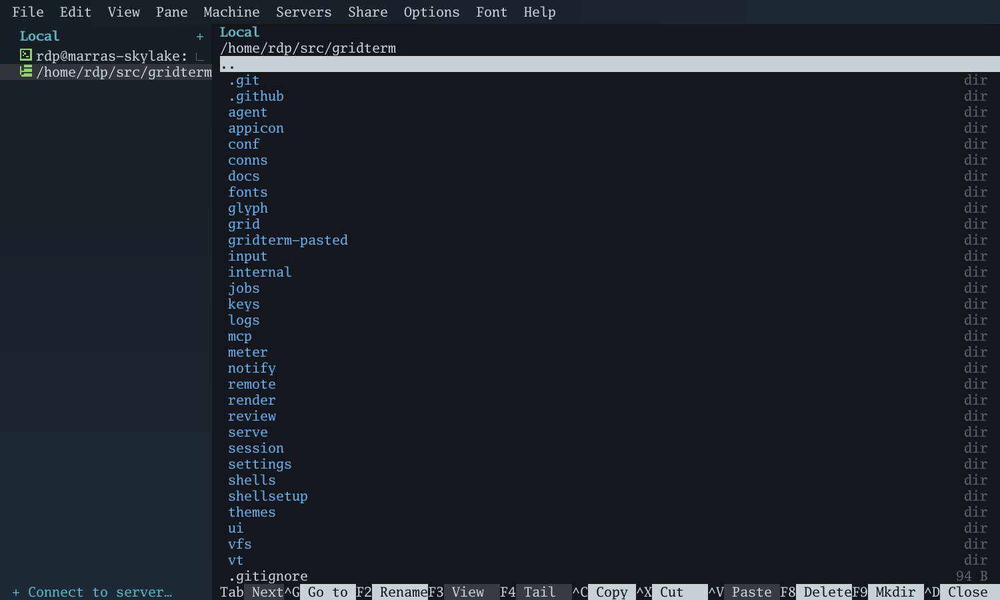

# gridterm

A GPU-rendered terminal emulator in Go, for Windows and Linux.

It runs a shell on a local pseudo-terminal -- a PTY on Unix, a ConPTY on
Windows -- or on another machine over SSH, feeds the output through a VT
emulator of its own, and draws the character grid as batched triangles.
A full screen of text is typically two draw calls, and a screen that did
not change draws nothing at all.

It is also a window manager for the things a terminal drags along with
it: panes on several machines at once, a two-pane file manager, a file
viewer, tunnels, and a way to hand a few panes to an agent without
handing over the machine.

71,729 lines of Go, 112,235 lines of tests, 3,697 tests.



## Install

**Download a build.** The [releases page](https://github.com/marrasen/gridterm/releases)
has a zip for Windows and a tarball for Linux, both amd64, with
`SHA256SUMS` beside them. There is nothing to install: unpack it and run
it.

**Or with Go.** There is no C toolchain to install, on either platform:

```
go install github.com/marrasen/gridterm@latest
```

**Or from source.** [BUILDING.md](BUILDING.md).

## Start

```
gridterm                       # your login shell
gridterm -ssh user@host        # a shell on another machine
gridterm -e 'vim /etc/hosts'   # one command
gridterm -font-size 18
gridterm -font /path/to/Regular.ttf,/path/to/Bold.ttf
```

With `-ssh` the window opens first and connects in a pane, so it asks
about an unknown host key in a dialog and keeps the account of how the
machine was reached. A new pane or split opens on that machine too, and
its row on the sidebar offers the rest: files, a command, a tunnel and
the account.

Text is drawn in the four Go Mono faces compiled into the binary:
regular, bold, italic and bold italic. `-font` takes font files instead,
comma separated, in the order regular, bold, italic, bold italic. Only
the regular font is required — a style you leave out borrows one you
gave. There is no way to pick a font by family name yet; give paths.

## What it does

- **A real terminal.** bash, vim and less all run: alternate screen,
  scrollback, true colour, the text attributes, cursor shapes, mouse
  modes and bracketed paste. Wide characters and combining marks are
  handled, and the box-drawing characters are drawn at the exact cell
  size so a framed TUI has unbroken lines.
- **Shells here and on other machines**, over one SSH connection that
  carries several panes, a file session and tunnels at once.
- **A two-pane file manager** with panes on as many machines as you
  like, and copying, moving and deleting that run in the background and
  say how far they have got.
- **A file viewer without a shell** -- paging, search, hex, tailing,
  syntax colour, and JSON logs laid out as logs.
- **Tunnels** -- local, remote and SOCKS5 -- each with a pane saying
  what it is carrying.
- **One gridterm working inside another**, including joining a program
  already running over there so both people see it.
- **Panes shared with an agent** over MCP, where one code reaches
  exactly the panes you shared and nothing else.

[FEATURES.md](FEATURES.md) has the whole list, in detail.





## Keys

gridterm comes with:

| Key | |
|---|---|
| `Shift+PageUp` / `Shift+PageDown` | scroll the scrollback |
| mouse wheel | scroll, or arrow keys on the alternate screen |
| drag | select; `Alt+drag` selects a rectangle |
| `Shift+drag` | select even while a program owns the mouse |
| `Ctrl+Shift+C` / `Ctrl+Shift+V` | copy and paste |
| middle click | paste |
| `Ctrl+=` / `Ctrl+-` / `Ctrl+0` | font size |
| `Ctrl+Shift+B` | show or hide the sidebar |
| `Ctrl+Shift+L` | go to the sidebar |
| `Ctrl+Shift+N` | connect to a server |
| `Ctrl+Shift+A` | show every pane at once |
| `F11` | fill the screen with the panes |

[USAGE.md](USAGE.md) covers the rest, and how to change a shortcut.

## Read more

| | |
|---|---|
| [FEATURES.md](FEATURES.md) | everything it does, in full |
| [USAGE.md](USAGE.md) | keys, shortcuts, sharing panes with an agent |
| [BUILDING.md](BUILDING.md) | building it, and building a release |
| [DESIGN.md](DESIGN.md) | why the code is the shape it is |
| [GAPS.md](GAPS.md) | what is not there yet |
| [LINUX.md](LINUX.md) | the state of the Linux build |
| [MENUS.md](MENUS.md) | every menu, written down |
| [WORDING.md](WORDING.md) | how dialogs, buttons and commands are worded |
| [DIALOGS.md](DIALOGS.md) | every dialog, written down |
| [COMMANDS.md](COMMANDS.md) | every command in the palette |
| [CHANGELOG.md](CHANGELOG.md) | what changed in each release |
| [RELEASING.md](RELEASING.md) | how a release is cut |
| [REMOTE-APPS.md](REMOTE-APPS.md) | an idea: remote windows inside gridterm |

## Licence

MIT; see [LICENSE](LICENSE). The dependencies are all permissive:
ebitengine and `golang.org/x/*` are Apache-2.0 or BSD, `pkg/sftp` and
`kr/fs` are BSD, and `go-vte`, `go-pty`, `uniseg`, `atotto/clipboard`
and `golang.design/x/clipboard` are MIT.

## How this was built

Each step was reviewed adversarially before the next one started, which
is where most of the interesting bugs came from — a crash on a
one-column screen, two denial-of-service paths, a deadlock between the
output pump and a device report, and a reaper that threw away a short
command's entire output. The commit messages record what each review
found.
