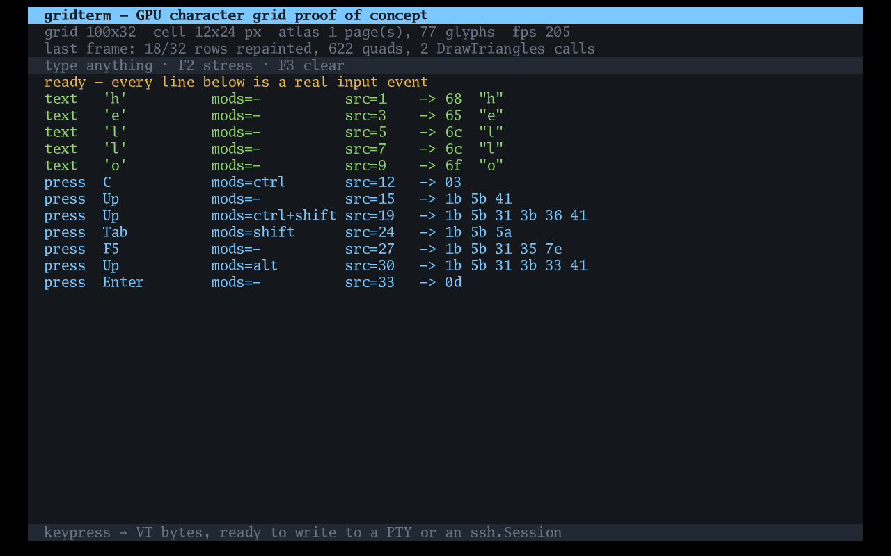
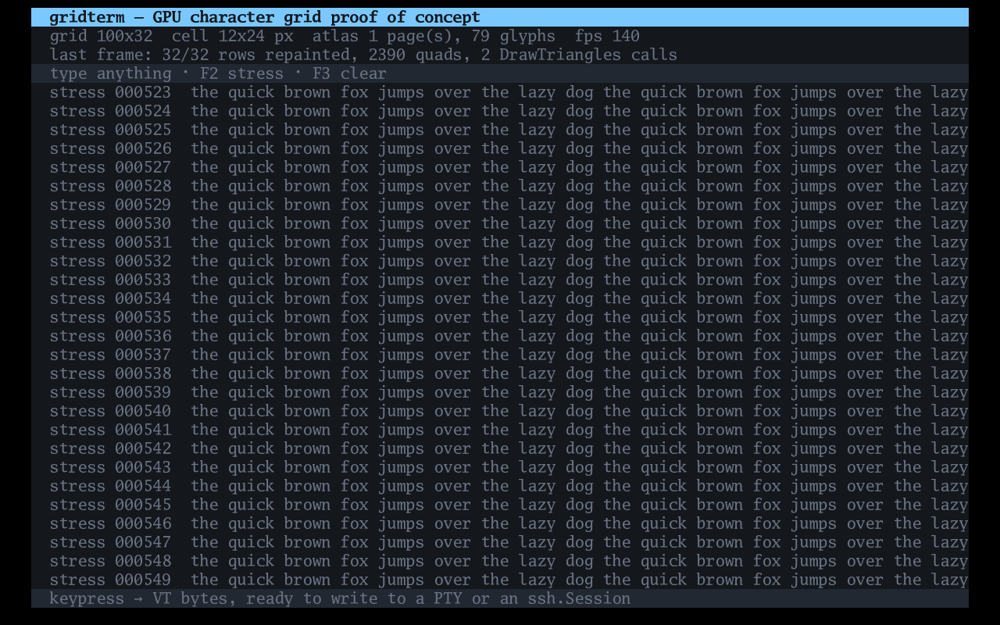

# gridterm

A proof of concept for a GPU-rendered character grid on Windows: the
rendering and input foundation a native terminal, SSH client or
terminal-style IDE would sit on.

It is 1,373 lines of Go plus 421 lines of tests. It is **not** a
terminal — there is no VT parser and no child process. It covers the
part that has to be right first, and the part that decides whether the
approach is worth pursuing.

## What it does

- **Batched glyph rendering.** Glyphs are rasterised once into 1024x1024
  texture pages, shelf-packed, and drawn as tinted quads. A full screen
  of text is one `DrawTriangles` call for all the backgrounds plus one
  per atlas page for the text — typically two calls total, regardless of
  how many characters are on screen.
- **Damage tracking.** `grid.Set` ignores writes that match what is
  already in the cell, so an idle screen dirties no rows and draws
  nothing at all. Combined with
  `ebiten.SetScreenClearedEveryFrame(false)`, a still window costs
  nothing per frame.
- **A real key pipeline.** Key press, release and OS repeat, with
  modifiers, correlated with the committed text they produced — then
  encoded to the bytes you would write to a PTY or an `ssh.Session`.
  Ctrl+C becomes `03`. Alt+Up becomes `CSI 1;3 A`. Shift+Tab becomes
  `CSI Z`.

The demo window shows every input event with its encoded bytes, plus
live counts of rows repainted, quads submitted and draw calls. `F2`
toggles a stress mode that pushes a fresh line every frame.

## Status

**Confirmed working on Windows.** Marcus ran `gridterm.exe` on real
hardware on 2026-09-13; text quality and behaviour looked right. The
DirectX 11 path is exercised.

It cross-compiles from Linux to a Windows executable, for both
architectures, with `CGO_ENABLED=0` and no C toolchain:

```
$ GOOS=windows GOARCH=amd64 CGO_ENABLED=0 go build -o gridterm.exe .
$ file gridterm.exe
gridterm.exe: PE32+ executable (console) x86-64, for MS Windows

$ GOOS=windows GOARCH=arm64 CGO_ENABLED=0 go build -o gridterm-arm64.exe .
$ file gridterm-arm64.exe
gridterm-arm64.exe: PE32+ executable (console) Aarch64, for MS Windows
```

On Windows, ebitengine renders through DirectX 11 or OpenGL via
[purego](https://github.com/ebitengine/purego), so there is no cgo
anywhere in the build. The "console" subsystem in the file type is
expected: ebitengine hides the console at startup via
`github.com/ebitengine/hideconsole`.

`go vet ./...` is clean for `GOOS=windows`, and the 54 tests covering
the grid model and the VT encoding pass.

The CPU side of a frame is measured, on an i7-6700K, for a 200x60 grid
(12,000 cells — a large terminal on a 4K display):

```
BenchmarkSetFullScreen-8      73311 ns/op    0 B/op   0 allocs/op
BenchmarkSetUnchanged-8       46018 ns/op    0 B/op   0 allocs/op
BenchmarkScrollUp-8            3442 ns/op    0 B/op   0 allocs/op
BenchmarkBGRunsUniform-8      38657 ns/op    0 B/op   0 allocs/op
BenchmarkEncodeText-8           3.455 ns/op  0 B/op   0 allocs/op
```

Rewriting every cell on screen costs 73 microseconds and allocates
nothing — about 0.4% of a 16.7 ms frame at 60 Hz.

It has also been run on Linux under a headless X server with software
rendering (llvmpipe — no GPU at all), driven by synthetic keystrokes.



Every encoding above is correct: `hello` arrives as five Text events with
distinct `src` ids; Ctrl+C is `03` and nothing else, with no duplicate
`c`; Ctrl+Shift+Up is `1b 5b 31 3b 36 41` (CSI 1;6 A); Shift+Tab is
`1b 5b 5a`; F5 is `1b 5b 31 35 7e`; Alt+Up is `1b 5b 31 3b 33 41`.
Note "18/32 rows repainted" — damage tracking is live.



Stress mode rewrites the entire screen every frame: 32 of 32 rows,
2,390 quads — and still **2 DrawTriangles calls**, at 140 fps. That is
with no GPU, inside a virtual framebuffer, while a screen recorder was
running. On real hardware this is not the bottleneck.

## Layout

| Package | Lines | Needs a GPU? | What it is |
|---|---|---|---|
| `grid` | 223 | no | the cell buffer, damage tracking, background run merging |
| `input` | 345 | no | key/text events to VT bytes — no toolkit import at all |
| `input/ebitenin` | 122 | no | the only file that knows about ebiten's input API |
| `glyph` | 234 | yes | glyph rasterising and shelf-packed atlas pages |
| `render` | 218 | yes | grid to batched triangles |
| `main.go` | 231 | yes | the demo window |

`input` deliberately does not import ebiten. The encoding rules are the
fiddly part and they should be testable on any machine — including this
one, which has no GPU and is missing the X11 development headers.
Swapping the window toolkit means rewriting `input/ebitenin` and nothing
else.

## The ebiten fork

`go.mod` replaces ebitengine with a local copy of
`github.com/unstablebuild/ebiten/v2 v2.7.5-ub.27`, the fork the Rune IDE
uses, at `../ebiten-ub`.

The fork matters because upstream ebitengine gives you polled
`IsKeyPressed` plus `AppendInputChars`. That cannot tell Ctrl+C from the
letter c, nor an OS key repeat from a fresh press, which rules out
writing a terminal against it. The fork adds `AppendInputEvents`, where
each observation is either a key transition (press/release/repeat with
modifiers) or a committed code point, tied together by an `InputSource`
id. It implements this properly on Windows, in the Win32 message loop,
correlating `WM_CHAR` messages with the key message `TranslateMessage`
posted them for.

The local copy carries exactly one change, needed to make the fork build
for Windows at all — see `../ebiten-ub/PATCH-NOTES.md`. That change is
worth sending upstream; with it merged, this project could depend on the
published fork directly.

Both ebitengine and the fork are Apache-2.0. Nothing in this project is
derived from the Rune IDE itself, which is GPL-3.0-or-later and keeps
its renderer and terminal emulator under `internal/` where they cannot
be imported.

## Running it

On Windows, just run the executable.

On Linux you need the X11 development headers ebitengine's bundled GLFW
compiles against. On Debian/Ubuntu:

```
sudo apt-get install -y libxcursor-dev libxinerama-dev libxi-dev \
    libxxf86vm-dev libxrandr-dev libgl1-mesa-dev
go run .
```

Tests need none of that:

```
go test ./grid/... ./input
```

## What comes next

In rough order of what would tell you the most:

1. Add a VT parser and screen model — [`go-vte`](https://github.com/aymanbagabas/go-vte)
   is a Go port of Alacritty's parser, permissively licensed, and is the
   same lineage as the one Rune uses.
2. Wire `golang.org/x/crypto/ssh` to it. SSH needs no local pty: the
   session channel plus `pty-req` and `window-change` is the whole
   interface.
3. Add local shells with [`go-pty`](https://github.com/aymanbagabas/go-pty),
   which wraps Unix PTYs and Windows ConPTY behind one interface.

Known gaps in what is here: no wide-character (CJK) cell handling, no
combining marks or shaping, no cursor rendering, no mouse, no selection,
no underline or strikethrough drawing (the attribute bits exist but the
renderer ignores them), and a single font size fixed at startup.
