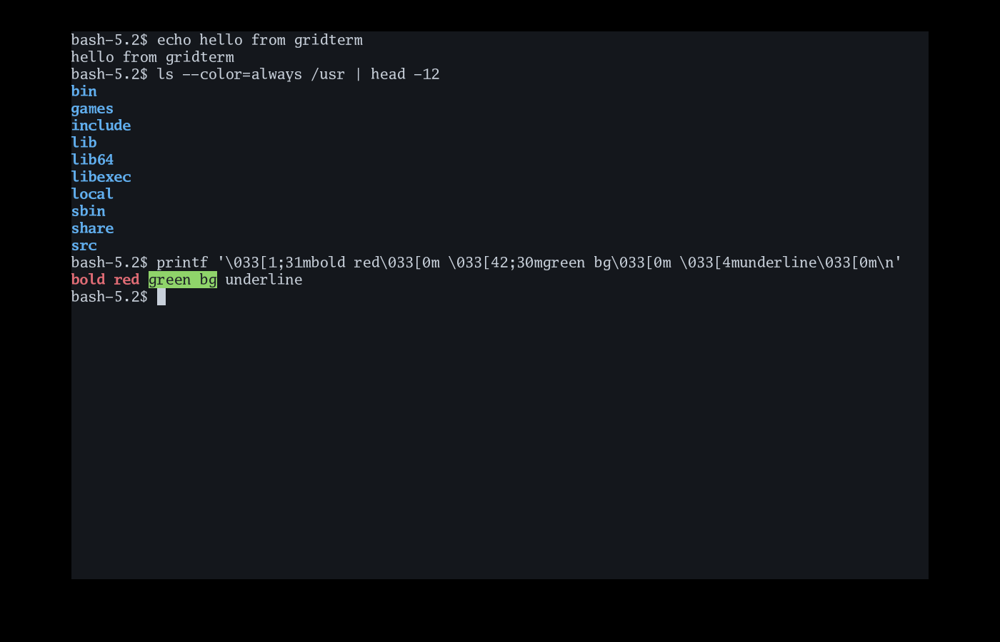
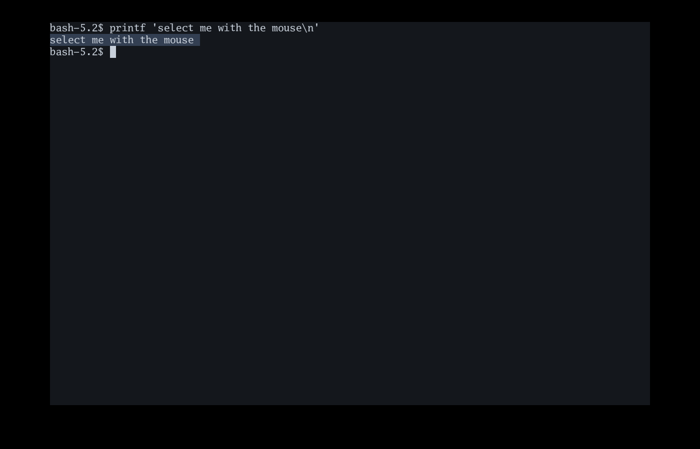
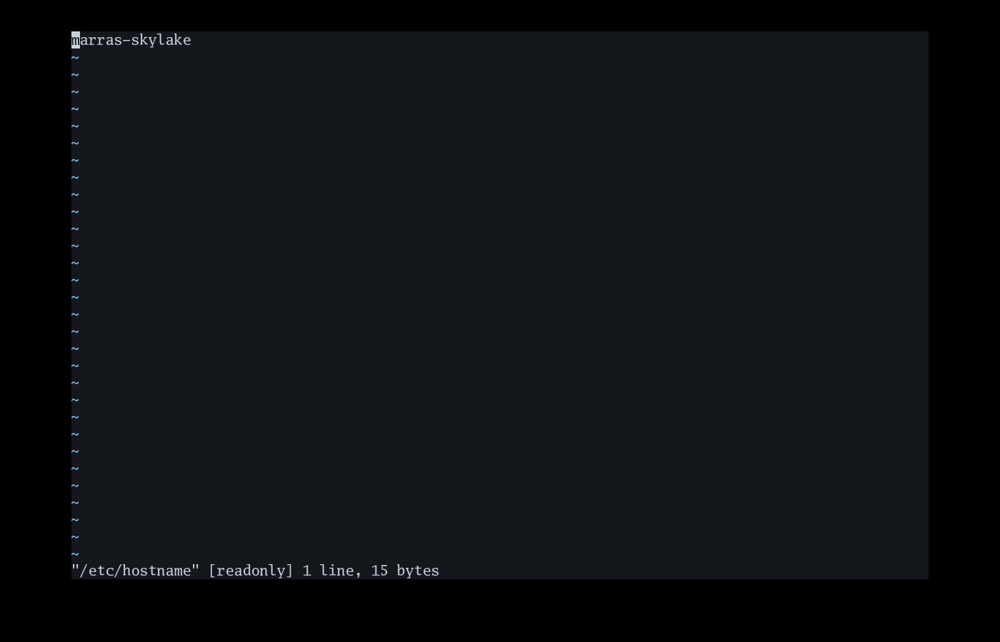

# gridterm

A GPU-rendered terminal emulator in Go, built for Windows first.

It runs a shell on a local pseudo-terminal — a PTY on Unix, a ConPTY on
Windows — or on another machine over SSH, feeds the output through a VT
emulator, and draws the resulting character grid as batched triangles.

5,946 lines of Go, 3,228 lines of tests, 236 tests.



## What works

- **A real terminal.** bash, vim and less all run: alternate screen,
  scroll regions, scrollback, 256 and true colour, bold, dim, italic,
  underline, strikethrough and reverse video, window title, cursor
  shapes, device reports, bracketed paste and mouse modes.
- **Local shells and SSH.** One `session.Session` interface with two
  implementations. Nothing above it — the emulator, the grid, the
  renderer — can tell the difference.
- **Batched rendering.** A full screen of text is one `DrawTriangles`
  call for the backgrounds plus one per atlas page for the glyphs,
  typically two in total however much text is on screen.
- **Damage tracking.** Writing a cell that already holds the same
  content does not dirty its row, so an idle screen draws nothing at all.
- **Wide characters and combining marks.** CJK and emoji take two
  columns; a base character and its marks share one cell.
- **Box drawing that joins up.** The box and block characters are drawn
  in code at the exact cell size, so framed TUIs have unbroken lines.
- **A real key pipeline.** Press, release and OS repeat with modifiers,
  correlated with the text they produced, encoded to the bytes a program
  expects — including application cursor mode, which vim and readline
  need.
- **Mouse, selection and clipboard.** Programs that ask for the mouse
  get it; hold Shift to select text anyway. Drag to select, Alt+drag for
  a rectangle.





## Try it

```
git clone https://github.com/marrasen/gridterm
cd gridterm
go run .                       # your login shell
go run . -ssh user@host        # a shell on another machine
go run . -e 'vim /etc/hosts'   # one command
go run . -font-size 18
go run . -font /path/to/Regular.ttf,/path/to/Bold.ttf
```

Text is drawn in the four Go Mono faces compiled into the binary:
regular, bold, italic and bold italic. `-font` takes font files instead,
comma separated, in the order regular, bold, italic, bold italic. Only
the regular font is required — a style you leave out borrows one you
gave. There is no way to pick a font by family name yet; give paths.

| Key | |
|---|---|
| `Shift+PageUp` / `Shift+PageDown` | scroll the scrollback |
| mouse wheel | scroll, or arrow keys on the alternate screen |
| drag | select; `Alt+drag` selects a rectangle |
| `Shift+drag` | select even while a program owns the mouse |
| `Ctrl+Shift+C` / `Ctrl+Shift+V` | copy and paste |
| middle click | paste |
| `Ctrl+=` / `Ctrl+-` / `Ctrl+0` | font size |

On Windows there is nothing else to install — no C toolchain, no cgo:

```
go build -o gridterm.exe .
```

Cross-compiling to Windows from anywhere else works the same way:

```
GOOS=windows GOARCH=amd64 CGO_ENABLED=0 go build -o gridterm.exe .
```

Building for Linux needs the X11 development headers ebitengine's
bundled GLFW compiles against:

```
sudo apt-get install -y libxcursor-dev libxinerama-dev libxi-dev \
    libxxf86vm-dev libxrandr-dev libgl1-mesa-dev
```

Most of the code needs neither. `make test` runs everything that does
not touch a GPU, which is the grid, the emulator, the key and mouse
encoders and both session types.

## Layout

| Package | Lines | Needs a GPU? | What it is |
|---|---|---|---|
| `vt` | 1,720 | no | the VT emulator: parser, screen model, two buffers, scrollback |
| `grid` | 592 | no | the display grid, damage tracking, selection, wide-character invariants |
| `input` | 818 | no | key, text, mouse and paste events to VT bytes |
| `session` | 983 | no | a shell as a byte stream: local pty or SSH |
| `glyph` | 914 | yes | glyph atlas, system font fallback, box drawing |
| `render` | 371 | yes | grid to batched triangles |
| `main` | 653 | yes | the window and the wiring |

The layering is deliberate: `vt` never imports the renderer, `input`
never imports ebiten (that lives in `input/ebitenin`), and `session`
knows nothing about any of them. Everything fiddly is testable without a
display, which is how the emulator got written.

## Looking at the pixels

Most of this is testable without a display, but the parts that are not —
a blurred panel, a rounded corner, a dialog drawn over the wrong thing —
are exactly the parts where a test tells you nothing useful. `-shot`
drives a real window through a short script and writes PNG files:

```
gridterm -shot "wait:60 key:ctrl+k wait:2 shot:palette.png"
```

The steps are `wait:<frames>`, `key:<chord>`, `type:<text>` and
`shot:<file>`, each taking one frame so that what a step did has been
drawn before the next one looks at it. Several `shot:` steps in one
script capture several states from one window launch. The window closes
when the script ends.

This found a bug that every test had passed over: the frosted panel was
drawing pure black, because a `SubImage` of the render target silently
draws nothing when used as a source on the Direct3D backend. Nothing
errored. It simply looked wrong, and nothing was looking.

## Design notes worth knowing

**Damage tracking is load-bearing.** `ebiten.SetScreenClearedEveryFrame(false)`
means a row the renderer skips shows the *previous* frame, not a blank.
A row wrongly considered clean is a visible bug, so `grid.Set` compares
before it writes and never dirties a row for content that did not
change.

**Nothing on a UI thread writes to a pty.** Writing to a pty blocks once
the program stops reading its input. Both the output pump — which holds
the terminal lock — and the ebiten thread produce input, so both queue
through a writer goroutine. Without that, a program that stops reading
wedges the whole window.

**Box characters are drawn, not looked up.** A font's box glyphs are cut
for that font's own advance width. Inside a terminal cell the strokes
stop short of the edges and adjacent cells do not meet, so every framed
TUI renders as a field of disconnected ticks.

**Host keys are checked with no fallback.** A terminal that silently
trusts an unknown SSH host key can be man-in-the-middled and nobody
finds out. An unverifiable host is a hard failure with an explanation.

## The ebiten fork

`go.mod` replaces ebitengine with
[marrasen/ebiten](https://github.com/marrasen/ebiten), a fork of
[unstablebuild/ebiten](https://github.com/unstablebuild/ebiten). `go
build` fetches it like any other dependency; there is nothing to check
out by hand.

Upstream ebitengine gives you polled `IsKeyPressed` plus
`AppendInputChars`, which cannot tell Ctrl+C from the letter c, nor an
OS key repeat from a fresh press. That rules out writing a terminal
against it. unstablebuild's fork adds `AppendInputEvents`, where each
observation is either a key transition or a committed code point, tied
together by an `InputSource` id — and it implements this properly on
Windows, in the Win32 message loop.

That fork does not itself compile for `GOOS=windows`: `initializeGLFW`
calls `glfw.InitHint`, which only the cgo glfw binding defines, so the
pure-Go Windows port fails to build. This fork is the same commit with
that one macOS-only call put behind a build tag — the branch is
`windows-build`, offered upstream. Once it lands there, the replace can
point back at unstablebuild's own tag.

ebitengine and both forks are Apache-2.0. Nothing here is derived from
the Rune IDE, which is GPL-3.0-or-later and keeps its renderer and
emulator under `internal/` where they cannot be imported.

## Known gaps

- **Fonts are chosen by file path, not by name.** `-font` takes paths.
  Matching a family name means reading the name table out of every font
  file on the system, grouping the four styles despite inconsistent
  subfamily strings, and rejecting proportional fonts; none of that is
  written yet.
- **A fallback glyph is always upright.** The system fonts consulted for
  runes the main font lacks are shared by every style, so CJK, braille
  and heavy box drawing stay regular even in bold or italic text.
- **Variable fonts render at their default instance.**
  `x/image/font/sfnt` does not apply variation axes, so asking such a
  font for its bold weight gets the default one.
- **Blink** is parsed and ignored.
- **Colour emoji** do not render. `x/image/font/sfnt` cannot read the
  bitmap tables that colour emoji fonts use.
- **Emoji ZWJ sequences and flags** show only their first glyph; the
  rest of the cluster is dropped rather than stacked in one cell.
- **OSC 52 clipboard writes** are parsed but not yet applied. Reads are
  deliberately never answered — replying would let any program that can
  write to the terminal exfiltrate the clipboard.
- **A click faster than one frame is missed.** ebiten reports the mouse
  as polled state, so a press and release inside the same 16 ms are
  never seen as either. No human manages it; a test harness does.
- **SSH needs its password up front.** A passphrase or password is
  prompted on the console before the window opens, because once gridterm
  is drawing its own grid there is nowhere to prompt.
- **Sixel and the Kitty graphics protocol** are not implemented.
- **An APC, PM or SOS string with no terminator grows without bound.**
  The parser buffers it before the emulator sees anything, so it cannot
  be capped from here; it needs a fix in `danielgatis/go-vte`, which
  already caps OSC the same way.
- `-e` splits its argument on spaces, with no quoting.

## Licence

MIT; see [LICENSE](LICENSE). The dependencies are all permissive:
ebitengine and `golang.org/x/*` are Apache-2.0 or BSD, and `go-vte`,
`go-pty`, `uniseg` and `atotto/clipboard` are MIT.

## How this was built

Each step was reviewed adversarially before the next one started, which
is where most of the interesting bugs came from — a crash on a
one-column screen, two denial-of-service paths, a deadlock between the
output pump and a device report, and a reaper that threw away a short
command's entire output. The commit messages record what each review
found.
